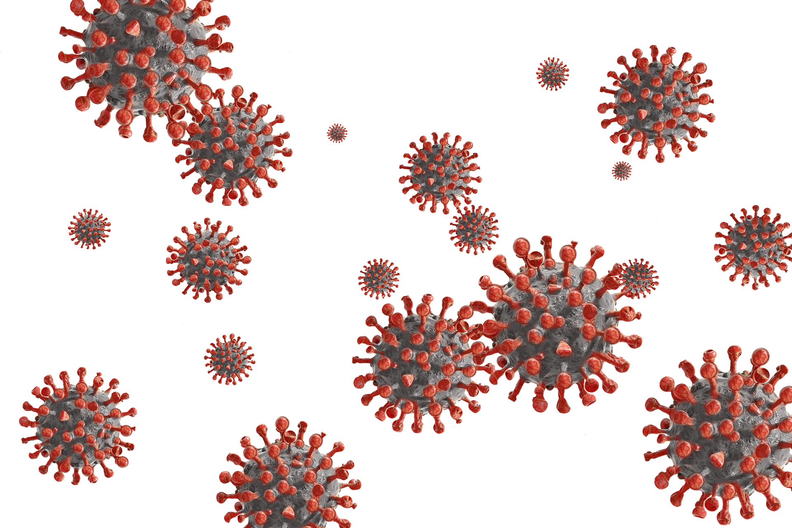

</img>
<h1 align="center">Project developed to list <strong>covid</strong> data</h1>

Project <strong>covid-data</strong>developed during the pandemic to inform about the virus

## :rocket: Tecnologias

[Node.js](https://nodejs.org/en/)
| [React.js](https://https://pt-br.reactjs.org/)
| [Javascript](https://developer.mozilla.org/pt-BR/docs/Aprender/JavaScript)
| [Html](https://tableless.com.br/o-que-html-basico/)
| [CSS](https://www.w3schools.com/css/)
| [Nodemon](https://nodemon.io/)
| [PostgreSQL](https://www.postgresql.org/)
| [Nunjucks](https://mozilla.github.io/nunjucks/)

## 💻 Project

### view the project -> https://covid-api-i8tnoa1xc.vercel.app/
